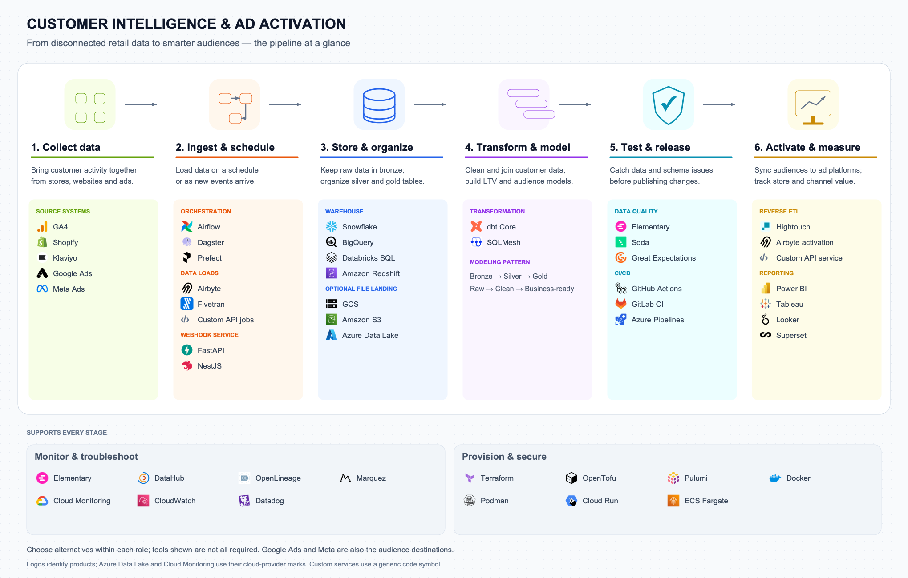
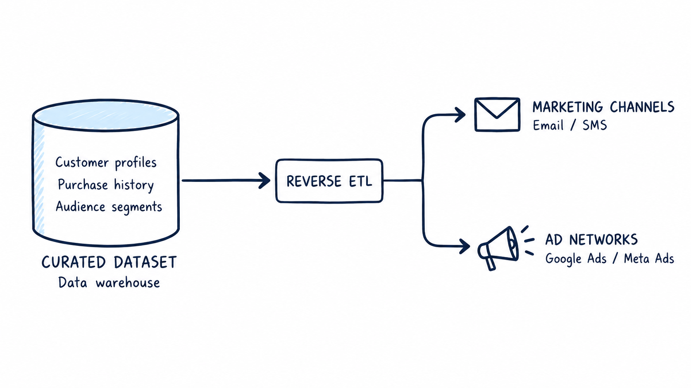
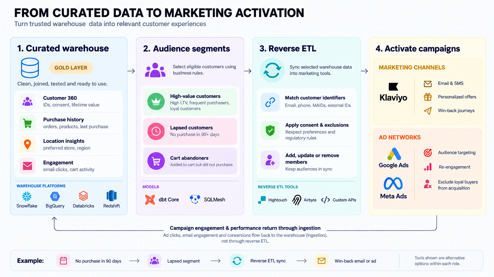

# Retail Customer Intelligence & Ad Activation

**Connect retail data, understand customers, and turn insights into relevant marketing audiences.**

This project brings together website activity, purchases, email engagement and advertising spend for a multi-location retailer. It turns disconnected records into a curated warehouse dataset, then uses **reverse ETL** to send selected customer audiences to marketing platforms.

> **Status:** Architecture and build blueprint. This package contains documentation and diagrams. Pipeline code and deployed infrastructure are not included yet.

## Why build this?

Retail data often lives in separate systems: GA4 captures browsing, Shopify records purchases, Klaviyo tracks email engagement, and advertising platforms report campaign spend. Without joining that information, teams struggle to identify valuable customers, compare store performance or avoid spending acquisition budgets on existing loyal buyers.

This project demonstrates how data engineering can connect those systems and support better marketing decisions. It is also a practical learning project for ingestion, data modeling, testing, orchestration and cloud infrastructure.

## How it works

The Reverse- ETL

1. **Ingest:** Collect source data through scheduled jobs and supported webhooks.
2. **Organize:** Preserve raw records in bronze, clean and join them in silver, and publish business-ready datasets in gold.
3. **Validate:** Test data quality and detect schema changes before affected data reaches reporting or activation.
4. **Activate:** Sync eligible audience members to marketing destinations using reverse ETL.
5. **Monitor:** Track freshness, failures, audience changes and operating costs.

Reverse ETL moves selected data **out of the warehouse into business tools**. Campaign engagement and performance return to the warehouse through ingestion.

## What is in the curated dataset?

The gold layer provides a consistent view of customers and their activity:

| Dataset | What it contains |
| --- | --- |
| Customer 360 | Customer IDs, consent, order count and historical customer value |
| Purchase history | Orders, products, refunds and last purchase date |
| Location insights | Store performance and preferred customer locations |
| Engagement | Identifiable browsing, cart and email activity |
| Audience membership | Customers eligible for each marketing segment |

For example, a customer with no purchase in 90 days could enter a **lapsed-customer audience**. Reverse ETL adds eligible members to a win-back audience. After another purchase, the customer leaves that segment and the next sync removes their membership.

Other example segments include high-value customers and cart abandoners. Segment definitions and consent checks should match the intended destination.

## Suggested tools

Choose one compatible option for each role; you do not need every tool listed.

| Stage | Reference tool | Alternatives |
| --- | --- | --- |
| Orchestration | Airflow | Dagster, Prefect |
| Batch ingestion | Python API jobs | Airbyte, Fivetran |
| Webhook ingestion | FastAPI | NestJS |
| Warehouse | Snowflake | BigQuery, Databricks SQL, Redshift |
| Transformation | dbt Core | SQLMesh |
| CI/CD | GitHub Actions | GitLab CI, Azure Pipelines |
| Data quality | dbt tests + Elementary | Great Expectations, Soda |
| Reverse ETL | Custom API service | Hightouch, supported Airbyte activation connectors |
| Infrastructure | Terraform | OpenTofu, Pulumi |
| Service hosting | Docker + Cloud Run | Containers on ECS Fargate |

The initial activation targets are **Google Ads and Meta Ads**. Email/SMS activation through Klaviyo is an optional extension.

## Build your own

Start with one source and a local audience export before adding the full platform.

1. **Prepare your environment.** Create a Git repository, choose a warehouse, configure development credentials and set cost limits.
2. **Create demo data.** Use synthetic customers, orders and store records with consistent identifiers. Add GA4 and engagement data when ready.
3. **Build ingestion.** Load records into bronze. Add pagination, retries and checkpoints so reruns do not duplicate business records.
4. **Build models.** Create silver customer and order tables, then gold customer profiles and audience segments. Test keys, relationships and totals.
5. **Protect changes.** Add CI checks and source-schema validation. Confirm that a deliberately renamed field produces a visible failure.
6. **Add activation.** Export an audience to a file or mock destination first. Then implement supported API syncs, including membership removals and retries.
7. **Demonstrate reliability.** Replay a failed job, handle a duplicate event, remove an ineligible customer and inspect monitoring results.
